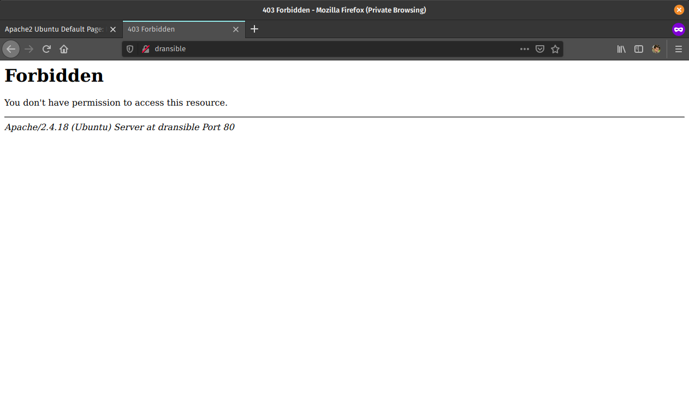
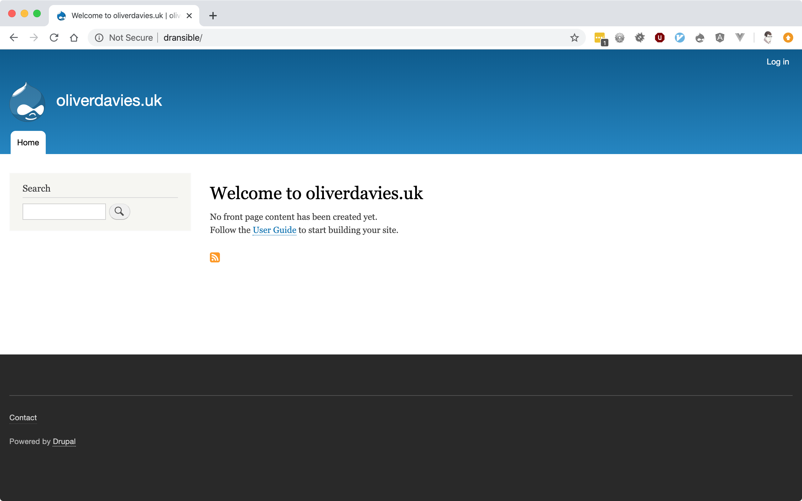

# Dransible

## Prerequisites

- [Ansible][ansible]
- [Vagrant][vagrant]
- Recommended: [Vagrant::Hostsupdater plugin][hostsupdater]

[ansible]: https://www.ansible.com
[hostsupdater]: https://github.com/cogitatio/vagrant-hostsupdater
[vagrant]: https://www.vagrantup.com

## Installation

1. Download roles from Galaxy:

    ```bash
    ansible-galaxy install -r tools/ansible/requirements.yml
    ```

1. Start the server:

    ```bash
    vagrant up
    ```

1. Provision the server:

    ```bash
    ansible-playbook tools/ansible/provision.yml
    ```

    If you go to the server IP address (`http://192.168.33.10`) then you should see the Apache2 default page.

    

    If you go to `http://dransible` then you should see a _Forbidden_ error as the application is not yet present on the server.

    

1. Deploy the application:

    ```bash
    ansible-playbook tools/ansible/deploy.yml
    ```

    After this, `http://dransible` should show an installed Drupal website.

    
